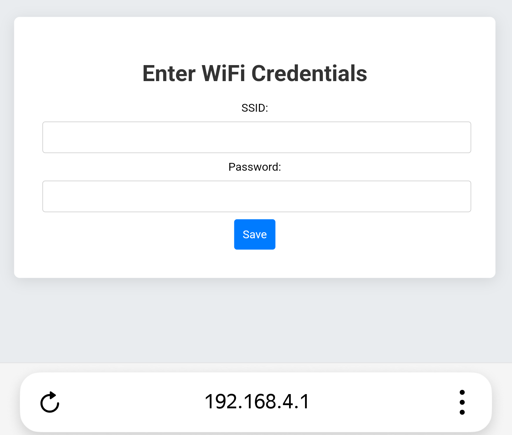
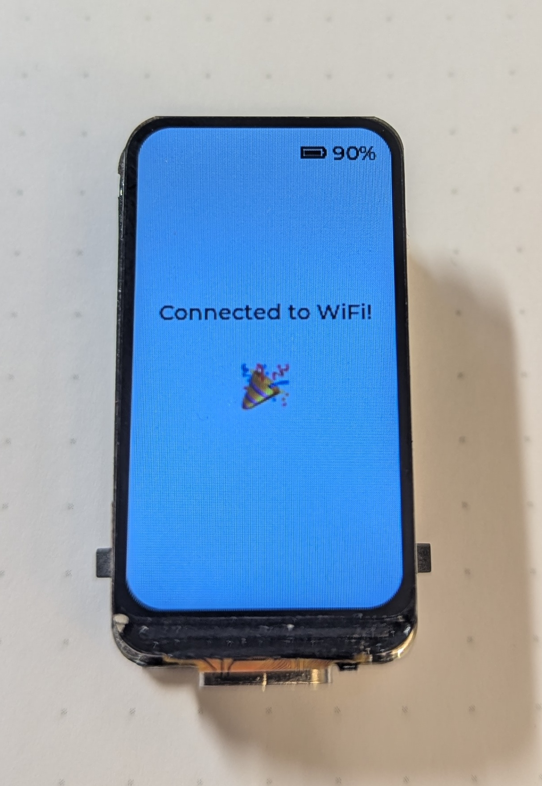

# Example 2 - Send Datalog

In this example Hikikomori Tamagotchi will connect to WiFi.

## Setting Up the Hikikomory Tamagotchi

After flashing, the Hikikomory device will enter setup mode. You’ll see the following screen:  

1. **Connect to the Access Point**  
   The device will create a Wi-Fi access point named `Hikkikomory-Tamagotchi`. Connect to this network.  

2. **Open the Web Interface**  
   In your browser, navigate to `192.168.4.1`. Fill in your WiFi network credentials.

   

3. **Save Settings**  
   Press the `Save` button to complete the setup.

---

## Using the Hikikomory Tamagotchi

Once the device connects to WiFi, it will show this screen.

   

To restart the device you can press the right button.